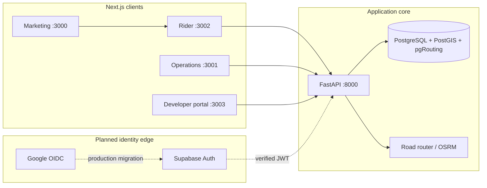
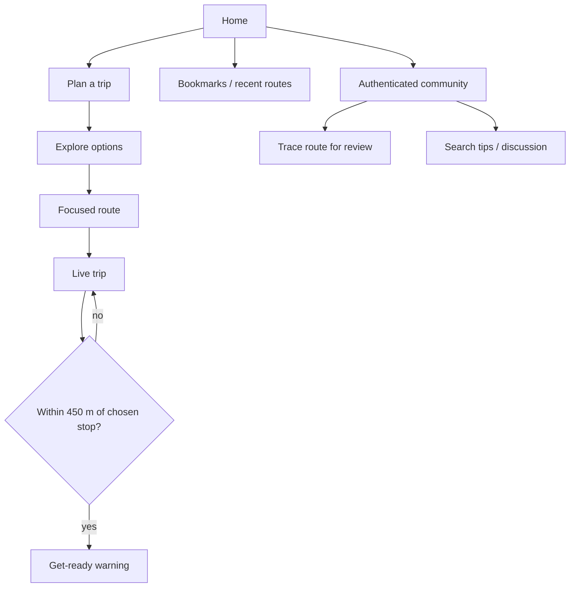

# Architecture

This document is the quickest way to understand how the repository fits together. It describes the intended production boundaries and calls out places where the current implementation is deliberately a scaffold.

## System map

## Ownership rules

- FastAPI owns domain rules, authorization, quotas, route search, route geometry orchestration, and persistence.
- PostgreSQL is authoritative for published routes, ordered stops, accounts, hashed credentials, usage events, contributions, and community posts.
- Next.js clients do not connect to PostgreSQL and never receive stored credential hashes.
- OSRM supplies road-following display geometry. Its result is a preview and does not prove a combi currently operates there.
- Browser geolocation is opt-in. Current live-trip calculations stay on the rider device.

## Rider flow

## API request path

Protected `/v1` calls reject missing credentials before database work. Presented keys are reduced to an indexed prefix plus SHA-256 digest lookup. A key is subject to a rolling-hour limit and a monthly quota before a usage row is inserted. Repeated invalid credentials are temporarily bounced by an in-process gate. A multi-instance deployment must replace that gate with Redis or an API gateway.

## Current versus production

| Area | Current | Production target |
| --- | --- | --- |
| Identity | PBKDF2 account and opaque sessions in FastAPI | Supabase Auth, Google provider, verified JWTs |
| Reset email | Token lifecycle implemented; delivery adapter not connected | Custom SMTP / transactional provider |
| Invalid-key gate | In-process memory | Shared Redis or edge gateway |
| Road geometry | Public OSRM endpoint with service cache | Contracted or self-hosted router with SLOs |
| Live trip | Browser distance-to-stop guidance | Map matching, route direction, offline behavior, telemetry consent |
| Community moderation | Route review state; posts publish directly | Trust tiers, reports, moderator queue, audit log |
| Bookmarks | Local storage | Account-synced collection with offline cache |

## Observability and account boundaries

The developer portal landing is public for sign-in, registration, and recovery. `/reference/*` and `/console` require a live FastAPI developer session checked by the Next.js server. The browser session is HttpOnly and account calls pass through a same-origin route handler. FastAPI's generated Swagger, ReDoc, and OpenAPI HTTP routes are disabled by default so they do not bypass the authenticated Fumadocs reference.

Keep browser sessions, metered API keys, and any future Supabase JWTs as distinct credentials. The current session is opaque and database-revocable; the public API key is also opaque and checked by digest. Supabase JWT verification is a proposed production boundary, not implemented identity configuration.

Prometheus/Grafana/OpenTelemetry topology, bounded-label rules, request lifecycle tracking, retention, and alerting are specified in [Observability and authentication architecture](docs/OBSERVABILITY_AND_AUTH.md). Delivery order and acceptance criteria are in the [work order](docs/WORK_ORDER.md).

## Read next

- [Product vision](docs/PRODUCT_VISION.md)
- [Backend guide](docs/BACKEND.md)
- [Frontend guide](docs/FRONTEND.md)
- [Route lifecycle](docs/ROUTE_LIFECYCLE.md)
- [Security](SECURITY.md)
- [Authentication decision](docs/AUTH_DECISION.md)
- [Observability and authentication architecture](docs/OBSERVABILITY_AND_AUTH.md)
- [Work order](docs/WORK_ORDER.md)
