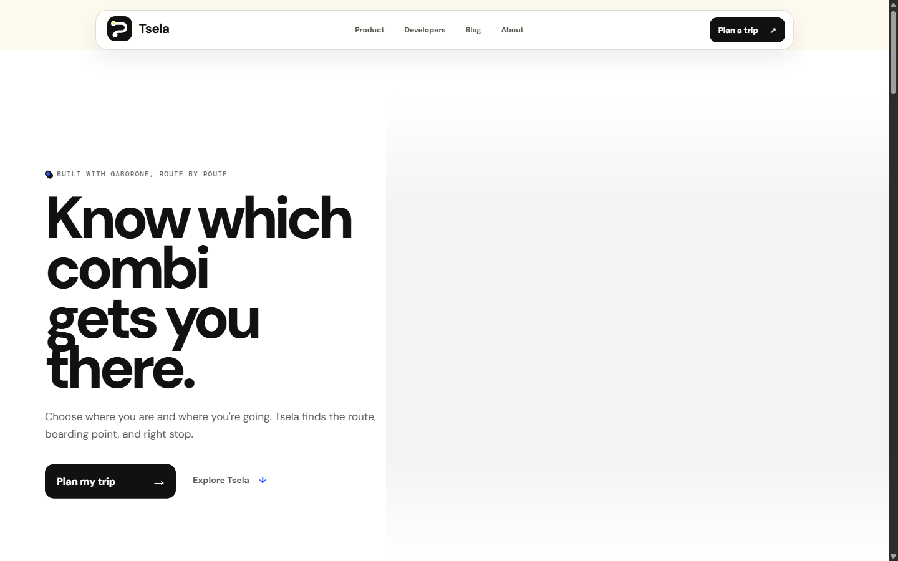
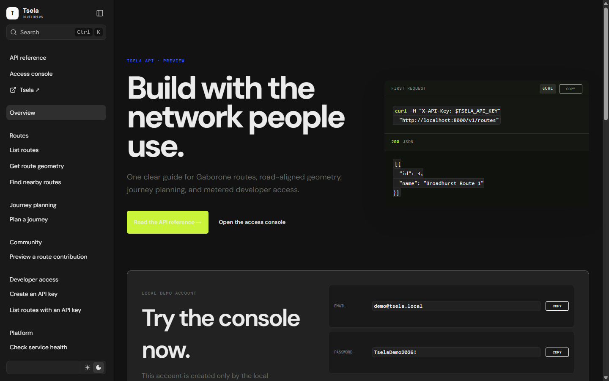
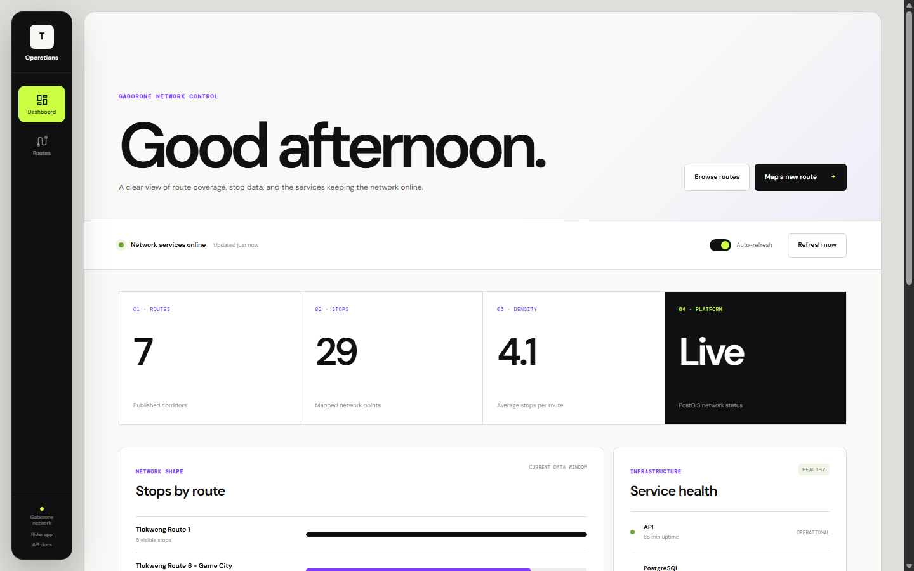
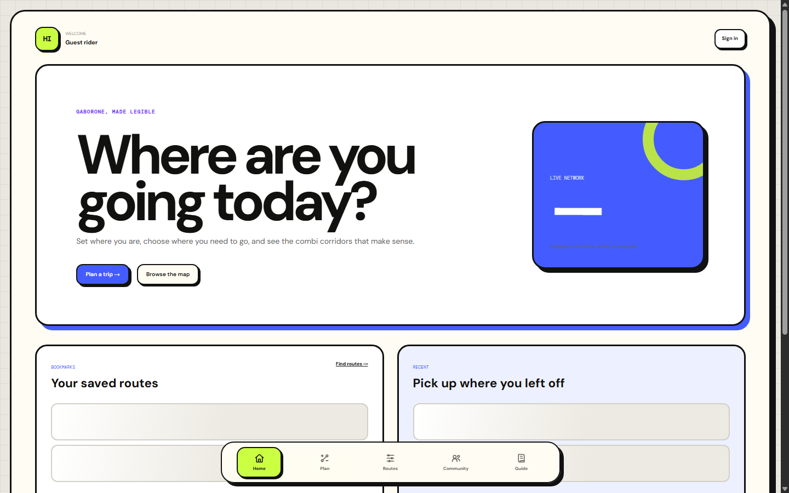
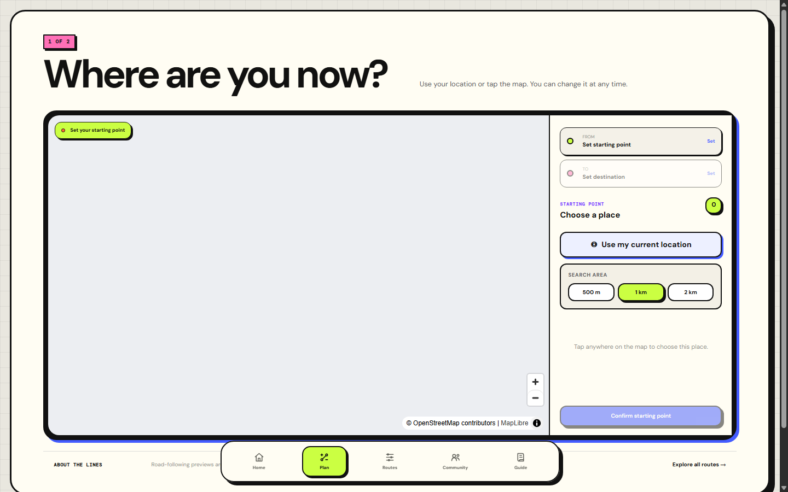
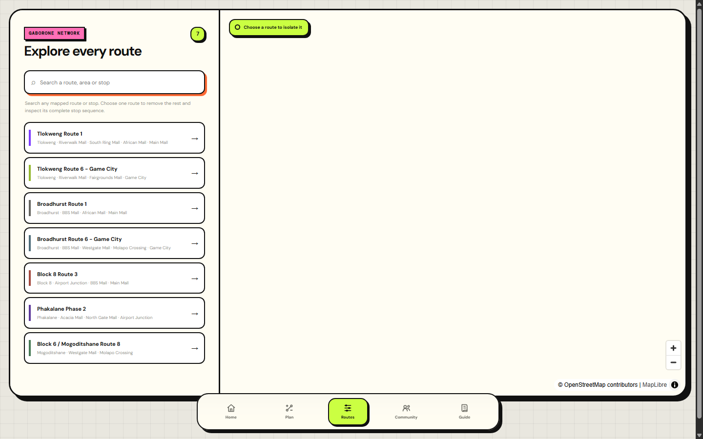
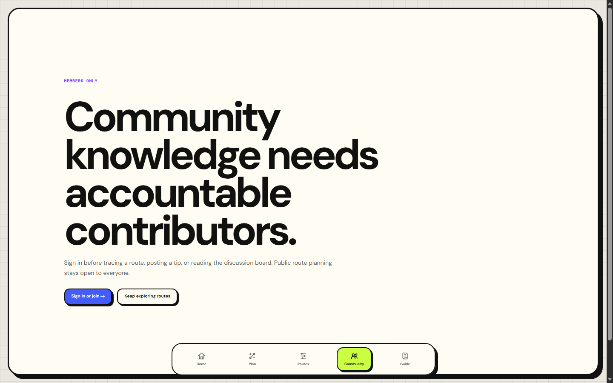
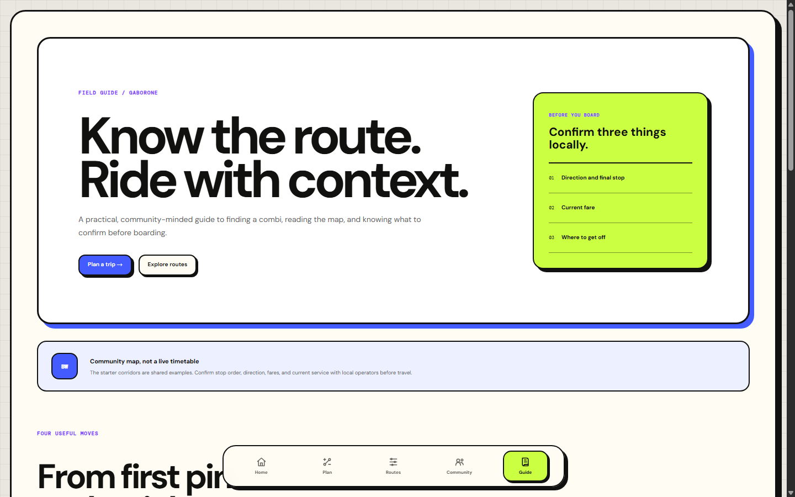

# TransitOS / Tsela



A Gaborone-first platform for finding your way around an informal transit network that, until now, only lived in people's heads. TransitOS turns the combi routes locals already know into a searchable map: pick a place, get real road-following directions, see where to board and where to ask the driver to stop.

**Tsela** is the working rider-facing brand for this project (public rename pending domain and trademark checks). Under the hood it's a five-surface platform — marketing site, rider app, operations dashboard, developer API, and an authenticated docs portal — backed by a FastAPI service and a PostGIS-routed PostgreSQL database.

## Why this exists

Gaborone's combis run understood, repeatable corridors, but that knowledge is local and informal. Ask "which combi gets me near the mall, and where do I get off?" and there's usually no map to answer it — just word of mouth. TransitOS makes that shared local knowledge visible and searchable: a rider picks an origin and destination and gets real combi options with a road-following route; a field operator can record a corridor by walking or riding it; community reports add current fare and crowding context; and the same API is open to anyone who wants to build on top of it.

It's also a working example of building a small platform properly: separate deployable surfaces instead of one tangled app, an API that's actually documented (not just annotated), sessions that get verified server-side rather than trusted on cookie presence, and honest docs about what's production-ready versus scaffolded.

## Screenshots

Real captures from the running Compose stack, not mockups.

| Developer portal | Operations dashboard |
| --- | --- |
|  |  |

**Rider app** — home, trip planning, the route list, community reports, and the rider guide:

| Home | Plan a trip |
| --- | --- |
|  |  |

| Routes | Community |
| --- | --- |
|  |  |



## Documentation

- [Demo credentials & endpoints](docs/DEMO_CREDENTIALS.md) — every URL, the demo account, first API call
- [Architecture](ARCHITECTURE.md) — system boundaries, request/data flows, and production gaps
- [Documentation index](docs/README.md) — complete reading map
- [Contributing](CONTRIBUTING.md) — setup, route evidence, code standards, and pull-request expectations
- [Code of Conduct](CODE_OF_CONDUCT.md) — community standards for this project
- [Security](SECURITY.md) — existing controls, injection defenses, and launch requirements
- [Security architecture](docs/SECURITY_ARCHITECTURE.md) — SSRF, JSON boundaries, roles, cost caps, and automated checks
- [Data model](docs/DATA_MODEL.md) — entity catalog, relationships, stable identity, timestamps, and deletion policy
- [System design playbook](docs/SYSTEM_DESIGN_PLAYBOOK.md) — scaling triggers, jobs, reliability patterns, and tracing
- [UX standards](docs/UX_STANDARDS.md) — adaptive hierarchy, loading, offline, motion, accessibility, and consent
- [API gateway](docs/API_GATEWAY.md) — public URLs, endpoints, payloads, and status behavior
- [Backend](docs/BACKEND.md) — FastAPI, persistence, migrations, pathfinding, and optimization internals
- [Frontend and UI](docs/FRONTEND.md) — pages, interaction patterns, visual system, and client data flow
- [Application user guide](docs/USER_GUIDE.md) — rider, operator, map, and health workflows
- [Gaborone starter data](docs/SEED_DATA.md) — seeded corridors, coordinates, provenance, and accuracy limits
- [Product vision](docs/PRODUCT_VISION.md) — five product surfaces, rider UX, field capture, community data, USSD, and partner integrations
- [Authentication decision](docs/AUTH_DECISION.md) — Supabase, Better Auth, and Google trade-offs
- [Production architecture](docs/PRODUCTION_ARCHITECTURE.md) — deployment topology, data flows, availability, and honest readiness status
- [Backup and disaster recovery](docs/BACKUP_AND_DISASTER_RECOVERY.md) — replicas, WAL, 04:00 tar archives, PITR, and restore drills
- [Object storage](docs/OBJECT_STORAGE.md) — S3-compatible uploads, signed URLs, validation, and retention
- [Production authentication](docs/PRODUCTION_AUTH.md) — self-hosted Supabase Auth, Google OAuth, JWT, and migration path
- [Operations integrations](docs/INTEGRATIONS_AND_WORK_MANAGEMENT.md) — Grafana notifications and OpenProject as a self-hosted Jira alternative
- [Launch checklist](docs/LAUNCH_CHECKLIST.md) — the evidence required before this can be called production-ready
- [Brand direction](docs/BRAND.md) — Tsela naming and draft visual system
- [Cost and capacity](docs/COST_AND_CAPACITY.md) — hourly limits and measurement model
- [Community service area](docs/SERVICE_AREA.md) — contribution bounds, enforcement, and polygon migration note

## Stack

- **Web:** Next.js, React, and TypeScript
- **API:** FastAPI and Pydantic
- **Database:** PostgreSQL, PostGIS, and pgRouting
- **Data access:** SQLAlchemy, GeoAlchemy2, and Alembic
- **Optimization:** Google OR-Tools
- **Observability:** Prometheus, Grafana, Tempo, OpenTelemetry, and PostgreSQL Exporter
- **Runtime:** Docker Compose locally; Kubernetes production scaffold

The Next.js applications are web clients only. FastAPI owns all HTTP APIs and database access.

## Services

The development stack now exposes the five product surfaces independently:

| Service | URL | Purpose |
| --- | --- | --- |
| Marketing | http://localhost:3000 | Focused homepage plus Services, Developers, and Company routes |
| Operations dashboard | http://localhost:3001 | Administrator-only route operations, account visibility, alerts, and system health |
| Rider app | http://localhost:3002 | Map-first route discovery, journey planning, and rider guide |
| Developer portal | http://localhost:3003 | Public sign-in/registration landing; live session required for API docs and console |
| API | http://localhost:8000 | FastAPI application; redirects to the developer portal |
| PostgreSQL | localhost:6000 | PostGIS and pgRouting database |
| Prometheus | http://localhost:9090 | Metrics storage, service health, and alert evaluation |
| Grafana | http://localhost:3004 | Operational dashboards and alert investigation |

FastAPI's generated Swagger, ReDoc, and OpenAPI HTTP routes are disabled by default. The protected Fumadocs reference is the developer documentation surface. Enable `API_DOCS_ENABLED=true` only for an isolated development environment where public interactive docs are acceptable.

## Product hierarchy

```text
Marketing
├── Services
├── Developers
├── Build journal (Markdown-backed)
└── Company

Rider
├── Home (profile, bookmarks, recent routes)
├── Plan a trip
├── Explore routes
│   └── Live trip guidance
├── Community (account required)
│   ├── Add a route
│   └── Search, tips, and discussion
└── Guide

Developer
├── Documentation
├── Account / recovery
└── Console (keys, quota, cost estimate)
```

## Run the complete stack

```bash
docker compose up --build
```

Alembic migrations and the idempotent Gaborone seed run automatically before the API starts. Open marketing at http://localhost:3000, operations at http://localhost:3001, the rider app at http://localhost:3002, and the developer portal at http://localhost:3003. Sign in with the local demo credentials shown there to open the dashboard and endpoint reference. Grafana is available at http://localhost:3004 and Prometheus at http://localhost:9090.

## Local development

Start PostgreSQL:

```bash
docker compose up -d db
```

Start the API with Python 3.12 through 3.14:

```bash
cd api
python -m venv .venv
.venv/Scripts/activate
pip install -e ".[dev]"
alembic upgrade head
uvicorn app.main:app --reload
```

Start the marketing site in another terminal:

```bash
cd marketing
npm ci
npm run dev
```

Start the operations dashboard:

```bash
cd admin
npm ci
npm run dev
```

Start the rider application:

```bash
cd rider
npm ci
npm run dev
```

Start the documentation site:

```bash
cd docs-site
npm ci
npm run dev
```

The web client defaults to `http://localhost:8000`. Override it with `NEXT_PUBLIC_API_BASE` when needed.

## Repository layout

```text
api/        FastAPI, SQLAlchemy, Alembic, routing, and OR-Tools
marketing/  Public Next.js marketing site (port 3000)
admin/      Private Next.js operations dashboard (port 3001)
rider/      Public Next.js rider application (port 3002)
docs-site/  Next.js developer portal, authenticated Fumadocs reference, and access console
database/   PostgreSQL/PostGIS/pgRouting image
observability/ Prometheus rules plus provisioned Grafana dashboards and alerts
ops/        Reviewed production-operation examples for backup and recovery
docs/       API gateway, backend, and frontend guides
compose.yaml
```

The former combined client remains in `web/` temporarily as migration reference and is not started by Compose.

## Safety and accuracy boundary

Route geometry follows roads when the routing service succeeds, but a road-following line does not verify current operation. Live-trip guidance is a browser-only distance estimate and must not be treated as safety-critical navigation. Fares, service times, directions, and stop order need recent local confirmation.

## Contributing

Bug reports, route corrections, and pull requests are welcome — see [CONTRIBUTING.md](CONTRIBUTING.md) for setup and expectations, and [CODE_OF_CONDUCT.md](CODE_OF_CONDUCT.md) for how we treat each other while doing it.

## License

MIT — see [LICENSE](LICENSE).
