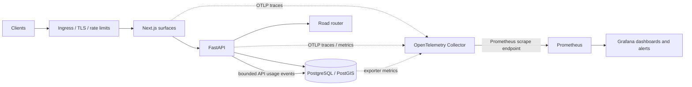

# Observability and authentication architecture

This is the production design sketch. It deliberately keeps request metrics, API usage records, and identity credentials as separate concerns.

## Request and telemetry flow

Run observability as an optional Compose profile during development so idle monitoring does not consume resources on every local run. In production, keep Prometheus, Grafana, the collector, and exporters on a private network; protect Grafana with its own identity and do not expose exporter ports publicly.

### Local observability access

Start the stack with `docker compose --profile observability up -d`. Grafana is available at `http://localhost:3004` and Prometheus at `http://localhost:9090`; both are bound to localhost. The local Grafana username is `admin`. Its password comes from `GRAFANA_ADMIN_PASSWORD` and falls back to `admin` only for local development. Set a non-default value before starting a shared environment. Anonymous Grafana access and self-registration are disabled. Production must inject the password from a secret manager and place Grafana behind the operator identity boundary.

The provisioned **Tsela platform health** dashboard is Grafana's local home dashboard. Its traffic, latency, process-memory, database-memory, database-size, connection, and cache-efficiency panels all query Prometheus. Grafana alert state changes are also sent to the authenticated admin notification feed; the dashboard is the diagnostic source, while the Tsela admin UI is the operator triage surface.

## What to measure

Instrument at the HTTP boundary around the full request/response so status and elapsed time reflect the endpoint result. FastAPI middleware supports measuring before dispatch and after the response; use a monotonic clock and attach one generated request ID to the response and logs. The same ID becomes the trace correlation field. [FastAPI middleware](https://fastapi.tiangolo.com/tutorial/middleware/)

Use OpenTelemetry instrumentation for FastAPI, outbound HTTP, SQLAlchemy, PostgreSQL, and Next.js server routes. Send OTLP to the OpenTelemetry Collector, which receives, processes, and forwards telemetry to backends. Keep exporters and sampling configurable by environment. [OpenTelemetry Collector](https://opentelemetry.io/docs/collector/quick-start/)

Start with these metric families:

| Metric | Type | Useful dimensions |
| --- | --- | --- |
| `http_server_requests_total` | Counter | service, method, route template, status class |
| `http_server_request_duration_seconds` | Histogram | service, method, route template |
| `api_key_requests_total` | Counter | plan or key state, normalized route template, status class |
| `api_key_rejections_total` | Counter | bounded reason: missing, invalid, revoked, expired, quota, hourly limit |
| `route_cache_requests_total` | Counter | cache name, hit/miss |
| `route_router_duration_seconds` | Histogram | provider, outcome |
| `database_pool_in_use` | Gauge | service, pool |
| `database_query_duration_seconds` | Histogram | service, bounded query family |
| `auth_events_total` | Counter | event type, outcome |

Metric labels must be bounded. Do not label metrics with API-key ID, account ID, email, full path with route IDs, raw query strings, coordinates, request ID, or token. Prometheus creates a new time series per unique label set, so high-cardinality data belongs in logs or the usage store instead. [Prometheus label guidance](https://prometheus.io/docs/practices/naming/)

## Dashboards and alerts

Create four Grafana dashboards:

1. **Service health:** request rate, error rate, p50/p95/p99 latency, uptime, and deployment version for each app.
2. **API access:** accepted requests, rejection reasons, hourly/monthly quota exhaustion, top normalized endpoints, and credential creation/revocation counts.
3. **Data and routing:** SQL pool saturation, query latency, PostGIS lookup time, route-cache hit ratio, OSRM latency/fallback rate, and data freshness.
4. **Capacity and cost:** CPU/memory, database storage/connections, egress, requests by service, and measured cost per 1,000 requests.

Alert on user-facing symptoms first: sustained 5xx rate, p95 latency above a measured target, API or docs unavailability, database saturation, route-router failure/fallback spikes, and missing telemetry. Add alert descriptions with the dashboard, owner, and first response. Avoid alerts that have no action; Grafana recommends symptom-based alerts and clear ownership. [Grafana alerting guidance](https://grafana.com/docs/grafana-cloud/observe-and-act/alert-and-measure-reliability/alerting/guides/best-practices/)

Do not set a public SLO from guesses. First collect representative traffic and route-provider baselines, then choose availability and latency targets with a stated measurement window and error budget.

## API request lifetime and usage records

The current `/v1` dependency checks the key, performs hourly and monthly usage counts, then inserts an `ApiUsage` row before the endpoint response is known. This is enough for a development quota, but it cannot accurately describe failures, duration, or the complete request lifecycle.

For production, split the flow:

1. **Authenticate:** hash the presented key, use its indexed prefix/digest, reject invalid/revoked/expired keys, and attach the key ID and owner to request context.
2. **Admit:** read quota/rate-limit state from a shared limiter. Reject early with a clear `429` and `Retry-After`; never count failed credentials as accepted API usage.
3. **Execute:** attach request ID and trace context, execute routing/database work, and collect response code and latency.
4. **Account:** write an accepted-use event with `key_id`, UTC time, method, normalized route template, status class, latency, and correlation ID. Avoid storing request bodies, secrets, raw query strings, or rider coordinates.
5. **Aggregate:** maintain hourly and billing-period counters with atomic increments. Keep raw operational events on a short retention window (initial proposal: 90 days); keep only monthly aggregates as long as contractual reporting requires.

Add `expires_at`, `last_used_at`, scopes, and rotation/revocation metadata to API keys. Store only a one-way digest of each secret; show the raw key once. Existing `(apiKeyId, occurredAt)` indexing is a starting point, but query plans and write volume should decide later indexes or time partitioning. Do not put every API key into Prometheus labels.

## API versioning and deprecation policy

The public surface is `/v1` today; there is no `/v2` yet and no deprecation has happened. Adopt this policy before it's needed under pressure:

- **Path-versioned, not header-versioned.** Keep the major version in the path (`/v1/...`) so cached responses, logs, and support requests are unambiguous without inspecting headers. A breaking change (removed field, changed type, changed auth requirement, changed error shape) requires a new `/v2` prefix; additive, backward-compatible fields do not.
- **Deprecation window.** Once `/v2` ships, `/v1` stays live for a stated minimum window (proposed: 12 months for a metered public API) before removal. Announce the window at the moment `/v2` becomes generally available, not at the moment removal is decided.
- **Signal deprecation in the response, not only in docs.** Add a `Deprecation` header (RFC 8594) and, once a removal date is fixed, a `Sunset` header on every deprecated-version response. Mirror the same dates in the Fumadocs reference page for that endpoint so the signal is visible to a human reading the docs and to a script reading headers.
- **Track usage per version.** The `api_key_requests_total` metric (see below) should carry the version as a bounded dimension (`v1`, `v2`, …) so a deprecation decision is based on measured remaining traffic, not a guess.
- **One deprecation at a time per endpoint family.** Do not stack multiple breaking changes into a single version bump; each breaking change gets its own version increment and its own sunset clock so consumers can migrate incrementally.

## Identity and token decision

The application has three credential types and they must remain distinct:

- **Browser developer session:** currently a random opaque bearer token, persisted as a digest in `DeveloperSession`; the developer site stores the browser copy in an HttpOnly, SameSite cookie and proxies account API calls server-side. Expiry and database lookup allow immediate revocation. Do not return it to local storage.
- **Public API key:** a separate random `tos_live_…` secret, stored by digest and sent in `X-API-Key`. It is not a JWT and must not be placed in a URL.
- **Future identity-provider JWT:** if Supabase is adopted, FastAPI verifies provider access tokens using the configured issuer and audience, a fixed algorithm allowlist, the issuer JWKS, and `exp`/`nbf`. Resolve `sub` to an application account and perform role/scopes checks server-side. Refresh JWKS safely and fail closed for unknown or invalid keys.

**Where secrets live:** none of the three credential types above should have their signing/hashing material in source control or in `compose.yaml` literals. The session-digest pepper, API-key hashing salt, and (if self-issued JWTs are ever added instead of Supabase-verified ones) the JWT signing key belong in environment variables injected at deploy time — `.env` locally (already gitignored), a secret manager (e.g. the hosting provider's built-in secrets store, or Vault/SOPS if self-managed) in production. Rotate the session/API-key hashing material on a defined schedule and on suspected compromise; rotation invalidates existing digests, so pair it with a re-auth path rather than a silent mass logout. If Supabase is adopted per [AUTH_DECISION.md](AUTH_DECISION.md), FastAPI never holds a private signing key at all — it only needs the issuer's public JWKS URL, which is not a secret.

Keep opaque sessions for this app-owned developer console while they meet needs. They are easier to revoke and audit than self-contained JWT sessions. Use identity-provider JWTs only at the Supabase-to-API boundary if the selected design needs them; do not replace metered API keys with JWTs. If JWT sessions become a requirement, define key rotation, short access-token life, refresh-token rotation/reuse detection, logout/revocation, issuer/audience ownership, and claim versioning before implementation.

Session lifecycle: issue on registration/login; verify before every protected docs/dashboard request; record creation and expiry; revoke the individual session on sign-out; revoke all sessions after password change/reset; invalidate expired or deleted accounts. API-key lifecycle: create once, reveal once, use, rotate with overlap only when explicitly needed, revoke, and retain a non-secret audit record of lifecycle events.

Supabase plus Google remains the proposed production identity path in [AUTH_DECISION.md](AUTH_DECISION.md), pending project credentials, domain, email delivery, redirect URI, privacy, and migration choices. The current local account system is a working scaffold, not a claim that Supabase has been connected.

## References

- [OpenTelemetry Collector quick start](https://opentelemetry.io/docs/collector/quick-start/)
- [Prometheus instrumentation](https://prometheus.io/docs/practices/instrumentation/)
- [Prometheus metric and label naming](https://prometheus.io/docs/practices/naming/)
- [Grafana dashboard practices](https://grafana.com/docs/grafana/latest/visualizations/dashboards/build-dashboards/best-practices/)
- [Grafana alert practices](https://grafana.com/docs/grafana-cloud/observe-and-act/alert-and-measure-reliability/alerting/guides/best-practices/)
